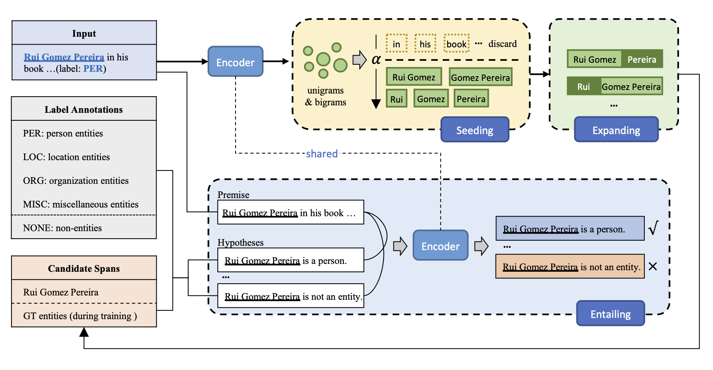

# SEE-Few

Code for "**SEE-Few: Seed, Expand and Entail for Few-shot Named Entity Recognition**", accepted at COLING 2022. For details of the model and experiments, please see [our paper](https://arxiv.org/abs/2210.05632v1). 


## Architecture



## Requirements

```bash
conda create --name see-few python=3.8
conda activate see-few
pip install -r requirements.txt
```


## Data

To make the experimental results more convincing and credible, we randomly sample 5 different groups of training sets and validation sets for each K. All the datasets have been uploaded to [datasets](./datasets/). 


## Train

```bash
bash scripts/run_conll.sh
```


## Acknowledgements

We thank the authors for sharing their codes of [Locate and Label](https://github.com/tricktreat/locate-and-label), [StructShot](https://github.com/asappresearch/structshot), [TemplateNER](https://github.com/Nealcly/templateNER) and [BaselineCode](https://github.com/few-shot-NER-benchmark/BaselineCode). 


## Contact

If you have any questions, please feel free to email `yangzeng@seu.edu.cn`. 


## Citation

```bibtex
@inproceedings{yang-etal-2022-see,
    title = "{SEE}-Few: Seed, Expand and Entail for Few-shot Named Entity Recognition",
    author = "Yang, Zeng  and
      Zhang, Linhai  and
      Zhou, Deyu",
    booktitle = "Proceedings of the 29th International Conference on Computational Linguistics",
    month = oct,
    year = "2022",
    address = "Gyeongju, Republic of Korea",
    publisher = "International Committee on Computational Linguistics",
    url = "https://aclanthology.org/2022.coling-1.224",
    pages = "2540--2550",
}
```